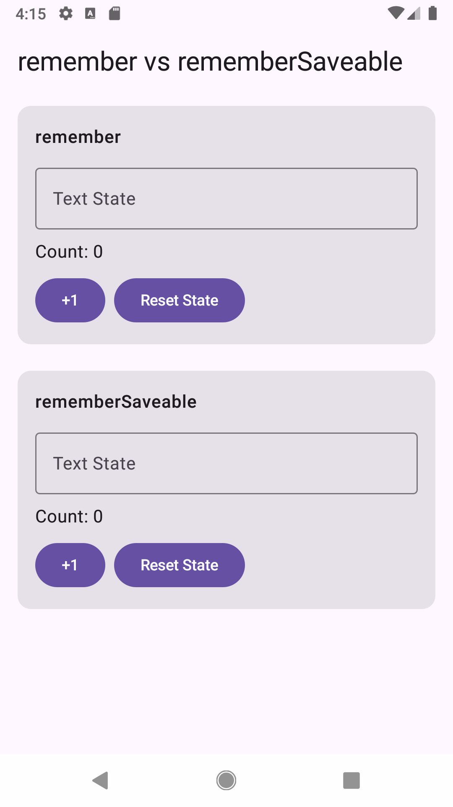
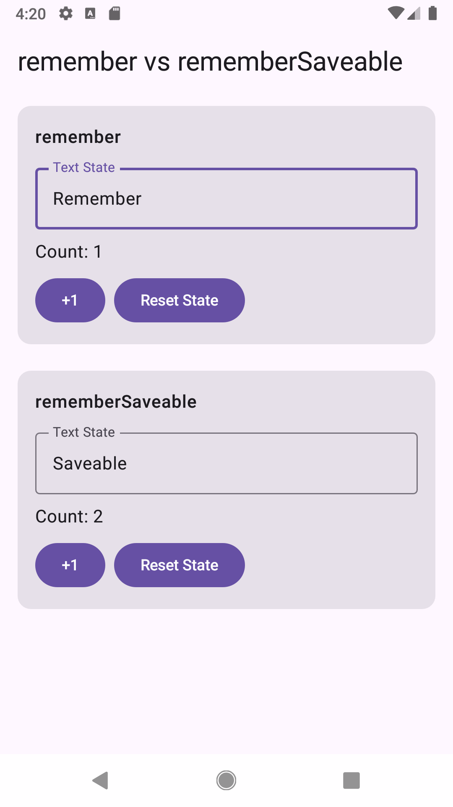
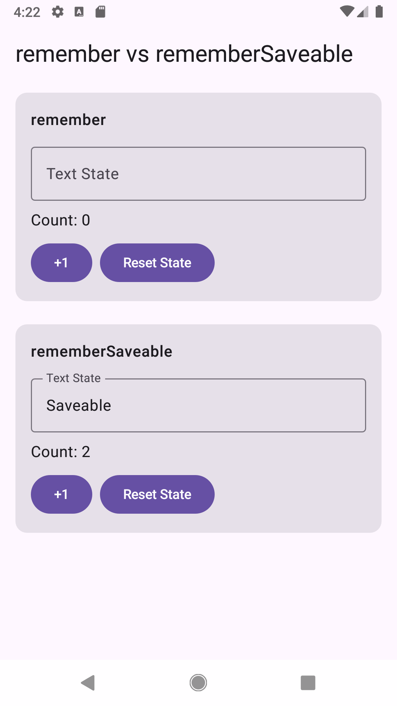

# compose-remember-saveable-sample

Jetpack ComposeのrememberとrememberSaveableの状態保持の違いを検証するサンプルアプリです。

## 概要

画面回転時やアプリ強制停止時の挙動を確認し、
それぞれの状態保持範囲の違いを検証します。

## 検証内容

### remember

- Composition内で状態を保持
- Activity再生成時は状態が失われる

### rememberSaveable

- Activity再生成時に状態を復元可能
- 永続保存ではない
- adbによる強制停止では状態は復元されない

## 動作確認環境

- Kotlin 2.4.0
- Jetpack Compose
- Material3
- Android Studio

## Screenshot

### Initial state

### Input state

### After rotation

## Article

https://qiita.com/nao-android/items/e9efbbc9025e3fc0af52

## License

MIT License
